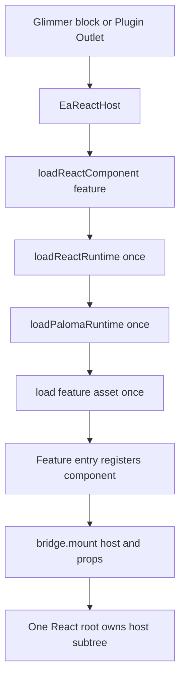
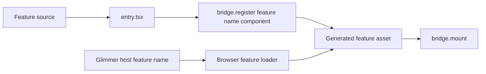
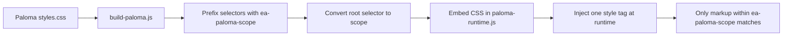

# EA Discourse Theme Developer Guide

This is a complete Discourse theme. Ember/Glimmer integrates with Discourse; React is reserved for isolated, feature-level UI. Paloma is shared by React features through a separate lazy runtime.

## Ownership Boundary

| Layer | Owns |
| --- | --- |
| Discourse and Glimmer | Plugin Outlets, blocks, routing, services, lifecycle, and all DOM outside a React host. |
| React bridge | React root creation, root reuse, component registration, and idempotent cleanup. |
| React feature | Its host subtree, local state, hooks, and explicit callbacks. |
| Paloma runtime | Approved Paloma controls, shared dependencies, `ThemeProvider`, and scoped runtime CSS. |

React must not import Discourse internals, call Discourse global event buses, or query/mutate Discourse-owned DOM.

## Prerequisites

- Node.js 22+
- pnpm 10+
- Discourse Theme CLI for a live preview

```bash
pnpm install --frozen-lockfile
pnpm typecheck:react
pnpm build
```

## Architecture

Three generated browser assets are loaded in dependency order:

```text
react-runtime.js
	React, ReactDOM, JSX runtime, and DiscourseReactHybrid bridge
	Loaded once when a React host requests a feature

paloma-runtime.js
	Approved Paloma controls, dependencies, ThemeProvider, scoped CSS
	Loaded once before a Paloma-backed feature asset

react/features/<feature>.js
	One React feature and its feature-only code
	Loaded only by the requested Glimmer host
```



The current sample uses the `counter` feature. Its block passes `@feature="counter"`; the generic loader fetches the base React runtime, shared Paloma runtime, and then `assets/vendor/react/features/counter.js`.

## Project Layout

```text
about.json                         Static Discourse asset registration
react-src/
	bridge.tsx                       Shared React root lifecycle and component registry
	global.d.ts                      Browser global type declarations
	paloma/
		index.tsx                      Approved Paloma imports and CSS entry
		adapter.ts                     Typed access to window.EaPaloma
	features/
		manifest.js                    Feature names, asset keys, source entries, output files
		<feature>/
			entry.tsx                    Registers the feature with the bridge
			<Feature>.tsx                Feature implementation
scripts/
	build-paloma.js                  Shared Paloma runtime build and CSS scoping
	build-react-features.js          Builds every manifest-defined feature
	watch-react.js                   Watches React, Paloma, and feature sources
javascripts/discourse/
	components/ea-react-host.gjs     Glimmer lifecycle boundary
	lib/load-react-runtime.js        Cached base runtime loader
	lib/load-paloma-runtime.js       Cached Paloma runtime loader
	lib/load-react-component.js      Cached feature loader and asset map
assets/vendor/
	react/react-runtime.js           Generated; commit
	paloma/paloma-runtime.js         Generated; commit
	react/features/<feature>.js      Generated; commit
```

## React Feature Flow

Every React feature is a separately built asset. It must self-register after its asset is loaded.



### Add a Feature

1. Add an entry to `react-src/features/manifest.js`:

```js
profileTools: {
	assetKey: "react-profile-tools",
	entryPoint: "react-src/features/profile-tools/entry.tsx",
	outputFile: "assets/vendor/react/features/profile-tools.js",
}
```

2. Add the matching static asset to `about.json`:

```json
"react-profile-tools": "assets/vendor/react/features/profile-tools.js"
```

3. Add `react-src/features/profile-tools/ProfileTools.tsx`. Keep props serializable through `ReactBridgeProps`; put all local interactive state in React.

4. Add `entry.tsx` beside it:

```tsx
import ProfileTools from "./ProfileTools";

window.DiscourseReactHybrid?.register("profile-tools", ProfileTools);
```

5. Add a thin Glimmer block or Plugin Outlet connector. Pass a feature name, component name, and only serializable data:

```gjs
<EaReactHost
	@component="profile-tools"
	@componentProps={{hash profileId=this.model.id}}
	@currentUser={{this.currentUser.user}}
	@feature="profile-tools"
/>
```

6. Register the Glimmer block in an API initializer. Prefer a Plugin Outlet, then a public Discourse API, then a native Glimmer component. Use React only for genuinely complex interaction.

7. Run `pnpm typecheck:react` and `pnpm build`, then commit source, `about.json`, and generated assets.

## Paloma Usage

The shared Paloma runtime avoids bundling the same Paloma dependencies into every feature. `react-src/paloma/index.tsx` is the only source file allowed to import `@paloma/core-ui` or `@paloma/core-ui/styles.css`.

Add an approved component there using narrow imports:

```tsx
import { Badge } from "@paloma/core-ui/components/Badge";
import { Button } from "@paloma/core-ui/components/Button";

window.EaPaloma = { Badge, Button, ThemeProvider };
```

Expose the same typed component in `react-src/paloma/adapter.ts`. Features access it through the adapter rather than reading `window.EaPaloma` directly:

```tsx
const { Button, ThemeProvider } = getPaloma();
```

Every Paloma-backed feature must render inside both the scope and provider:

```tsx
<div className="ea-paloma-scope">
	<ThemeProvider theme="ea-blue" mode="light">
		<Button onPress={save}>Save</Button>
	</ThemeProvider>
</div>
```

### CSS Isolation

Paloma CSS contains broad utility selectors. It must never be imported from `common.scss`, `stylesheets/`, `.gjs` files, or feature entry points.



`build-paloma.js` injects the scoped stylesheet once. This prevents Paloma utilities from affecting Discourse outside the React feature subtree.

## Build and Watch

| Command | Purpose |
| --- | --- |
| `pnpm typecheck:react` | Strict TypeScript validation for `react-src`. |
| `pnpm build:react` | Builds the base React runtime. |
| `pnpm build:paloma` | Builds shared Paloma runtime, scopes CSS, and enforces its size budget. |
| `pnpm build:features` | Builds every feature in the feature manifest. |
| `pnpm build` | Runs all production builds in order. |
| `pnpm watch` | Keeps base React, Paloma, and feature bundles rebuilding during development. |
| `discourse_theme watch .` | Syncs/previews the theme against Discourse. |

Run `pnpm watch` and `discourse_theme watch .` in separate terminals. A theme installed from Git does not run pnpm, so generated files under `assets/vendor/` must always be committed.

## Asset and Size Policy

`about.json` is static metadata. Every separately lazy-loaded feature requires one matching asset entry; the feature manifest and the browser loader’s `featureAssets` map must use the same name and asset key.

The shared Paloma runtime has a hard 10 MB gzip budget. `pnpm build:paloma` fails when the generated asset exceeds it. This is a ceiling, not a target: use narrow Paloma imports, review runtime size when adding controls, and keep feature bundles small by externalizing React and Paloma.

## Verification Checklist

- `pnpm typecheck:react` and `pnpm build` pass.
- Generated React, Paloma, and feature assets are committed.
- Runtime loaders fetch each asset once and reuse cached promises.
- Each host creates one React root and cleanup is safe to call more than once.
- Navigating away unmounts React; returning remounts it without duplicate handlers.
- Anonymous and signed-in visitors receive valid serializable props.
- Paloma CSS remains under `.ea-paloma-scope`.
- Keyboard navigation, visible focus, mobile layout, and both Discourse color schemes work.
