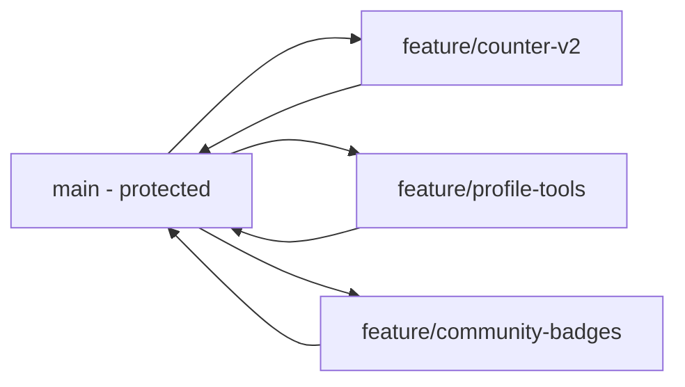

# Multi-Developer Collaboration Guide

## 1. Purpose

This document explains how multiple developers can work on this theme's enhancements at the same time — in parallel React features, Paloma additions, and Glimmer blocks — without blocking each other or repeatedly conflicting on the same files.

## 2. Why This Theme Parallelizes Well

The feature-bundle architecture (see `README.md`) already isolates most work by design:

```text
react-src/features/<feature>/     <- one folder per feature, owned by one developer/pair
javascripts/discourse/blocks/     <- one block file per feature
react-src/shared_components/index.tsx        <- single shared Paloma barrel (narrow surface)
react-src/features/manifest.js    <- single shared feature registry (small, append-only)
about.json                        <- single shared asset map (small, append-only)
```

Only the last three files are genuinely shared across features. Everything else — a feature's component, its entry point, its block, its scoped SCSS — can be developed, reviewed, and merged independently.

## 3. Branching Model



- `main` is protected: requires an MR, passing CI (typecheck, build, generated-asset drift check, tests), and at least one review.
- One feature branch per feature/enhancement, named `feature/<feature-name>`.
- Keep feature branches short-lived. Rebase on `main` frequently to pick up unrelated merges early instead of one large conflict at the end.

## 4. Assigning Work Without Collisions

Divide work **by feature folder**, not by file type:

| Developer | Owns |
| --- | --- |
| Dev A | `react-src/features/counter/**`, `javascripts/discourse/blocks/block-react-counter.gjs`, `stylesheets/components/shared_components.scss` (counter-specific rules only) |
| Dev B | `react-src/features/profile-tools/**`, `javascripts/discourse/blocks/block-profile-tools.gjs`, its own SCSS partial |
| Dev C | `react-src/shared_components/index.tsx` additions (new approved component), `react-src/shared_components/adapter.ts` |

Each developer's changes stay inside their own feature folder for 95% of the work. This is what makes true parallel development possible — two people rarely touch the same file at the same time.

## 5. Handling the Three Shared Files

These are the only files every feature branch is likely to touch. Treat them as **append-only, single-line-per-feature** to minimize conflicts:

### `react-src/features/manifest.js`
```js
export const features = {
  counter: { assetKey: "react-counter", entryPoint: "...", outputFile: "..." },
  profileTools: { assetKey: "react-profile-tools", entryPoint: "...", outputFile: "..." }, // new line only
};
```
Add one new object entry per feature. Never reformat or reorder existing entries in the same MR as your feature.

### `about.json` → `assets`
```json
"react-counter": "assets/vendor/react/features/counter.js",
"react-profile-tools": "assets/vendor/react/features/profile-tools.js"
```
Same rule: append one key, don't touch others.

### `javascripts/discourse/api-initializers/homepage-blocks.gjs`
Add one `import` line and one entry to the `renderBlocks` array for your block only. Don't reorder the existing array.

If two feature branches both append here, Git resolves it automatically as long as each MR only adds lines and doesn't touch neighboring lines. Rebase before merging to catch the rare case where two people append at the exact same array position.

## 6. Local Development Without Stepping on Each Other

- Each developer runs their own `pnpm watch` and their own `discourse_theme watch .` against their **own dev/preview theme ID** (see `deployment-strategy.md`, Option D). Never share one remote theme ID between two developers — one person's live sync will overwrite the other's.
- Because features build to independent files (`assets/vendor/react/features/<feature>.js`), running `pnpm build:features` never touches a teammate's feature output.
- The shared runtimes (`react-runtime.js`, `shared_components-runtime.js`) only need a rebuild when someone changes `react-src/bridge.tsx` or `react-src/shared_components/index.tsx` — communicate in your team channel before editing either, since both are shared dependencies for everyone's feature.

## 7. Adding a New Paloma Component (Shared Surface)

Because `react-src/shared_components/index.tsx` is the only allowed import site for `@paloma/core-ui`, treat it like a small shared API:

1. Whoever needs a new Paloma control (e.g., `Badge`) opens a small, standalone MR that only adds the import/export to `index.tsx` and `adapter.ts`.
2. Get that merged first, independent of any feature that will use it.
3. Feature branches then only need to rebase to pick up the newly available control — they never edit `shared_components/index.tsx` themselves.

This turns Paloma additions into a fast, low-conflict, single-purpose MR instead of something bundled inside a larger feature change.

## 8. Code Review Checklist for Parallel Work

Before approving any feature MR, confirm:

- Changes are contained to the feature's own folder plus at most one line each in `manifest.js`, `about.json`, and `homepage-blocks.gjs`.
- `pnpm typecheck:react` and `pnpm build` pass, and the generated `assets/vendor/**` diff is included in the MR.
- No edits to another feature's files, another feature's SCSS rules, or the shared bridge/Paloma barrel unless that is the explicit purpose of the MR.
- The feature's Glimmer block passes only serializable props and does not introduce a new lifecycle pattern outside `EaReactHost`.

## 9. Conflict Recovery

If two feature branches do conflict on one of the shared files:

- The conflict is almost always a two-line insert (each branch's new array/manifest entry) — resolve by keeping both lines, not by picking one side.
- Never resolve a conflict by regenerating `assets/vendor/**` from an old branch state; always rebuild (`pnpm build`) after resolving source conflicts, then re-diff the generated assets before committing.
</content>
