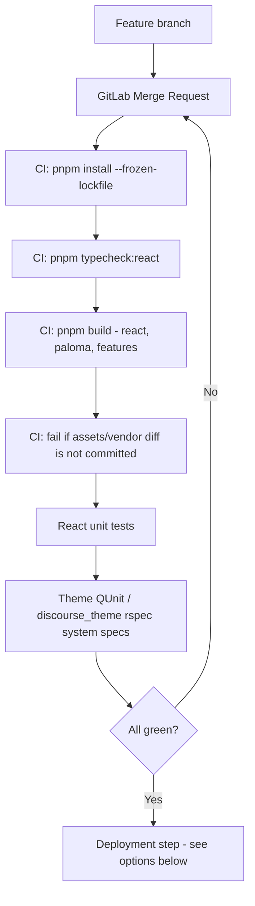

# Discourse Theme Deployment Strategy — Analysis Document

## 1. Purpose

This document analyzes deployment approaches for shipping this theme (Ember/Glimmer + React + Paloma) from our protected EA GitLab repository to Discourse, with automated testing as a release gate. It is meant to help decide the best feasible approach — it is not itself the final decision.

## 2. Constraints and Requirements

- Source of truth is an EA-side GitLab repository, fully protected (branch protection, MR review).
- React components require testing (unit + build verification) before anything reaches Discourse.
- Ember/Glimmer theme code should also pass Discourse-native test suites (theme QUnit / system specs) where feasible.
- Seniors want to avoid giving the Discourse platform direct read access into the protected EA repository, if a reasonable alternative exists.
- Generated runtime assets (`assets/vendor/react/react-runtime.js`, `assets/vendor/paloma/paloma-runtime.js`, `assets/vendor/react/features/*.js`) must always be committed and in sync with source, since Discourse does not run pnpm/esbuild/Vite when installing/updating a theme.
- Deployment must support at least two environments (staging, production) and a rollback path.

## 3. Common Pipeline (applies to every option)



The deployment step (J) is the only part that differs between options.

## 4. Options

### Option A — Discourse installs directly from the private EA GitLab repository

```text
EA GitLab (protected) --SSH deploy key--> Discourse (Git-sourced theme)
```

**Mechanism:** Admin installs the theme via *Appearance → Install → From a git repository*, using the EA repo's SSH URL. Discourse generates an SSH key; it is added as a **read-only deploy key** on the EA GitLab project. Discourse polls the tracked branch once a day, or an admin clicks **Check for Updates / Update to Latest**.

| Aspect | Assessment |
| --- | --- |
| EA repo access granted to Discourse | Yes (read-only deploy key) |
| Extra repositories to maintain | None |
| Uses Discourse's native update UX | Yes |
| Release granularity | Whole repository (all source, not just built output) |
| Rollback | Revert commit / select previous theme history in Discourse admin |
| Automation effort | Lowest |
| Meets "no EA access" preference | **No** |

### Option B — CI publishes only built output to a separate deployment repository

```text
EA GitLab (protected) --CI--> deployment repo (release-only) --SSH deploy key--> Discourse
```

**Mechanism:** EA CI builds and tests as in Section 3, then copies only the theme's releasable files (about.json, javascripts/, stylesheets/, common/, locales/, settings.yml, and the generated assets/vendor/ bundles) into a second, low-sensitivity Git repository. Discourse installs/updates from that repository using the same Git-sourced flow as Option A.

| Aspect | Assessment |
| --- | --- |
| EA repo access granted to Discourse | No — only the deployment repo is exposed |
| Extra repositories to maintain | One (deployment repo) |
| Uses Discourse's native update UX | Yes |
| Release granularity | Whole built theme (no EA-only source, tooling, or history) |
| Rollback | `git revert` on the deployment repo, or Discourse's theme history |
| Automation effort | Medium (CI sync/publish job) |
| Meets "no EA access" preference | **Yes** |

### Option C — CI publishes a versioned archive; deployment step imports it

```text
EA GitLab (protected) --CI--> versioned .tar.gz/.zip artifact --deploy job--> Discourse
```

**Mechanism:** CI builds and tests, then produces an immutable, versioned archive (e.g., stored in GitLab Package Registry). A separate, protected deployment job imports that exact artifact into Discourse (via the admin "From your device" flow, or — for self-hosted Docker only — `bin/rake themes:install:archive`).

| Aspect | Assessment |
| --- | --- |
| EA repo access granted to Discourse | No |
| Extra repositories to maintain | None (registry entry, not a repo) |
| Uses Discourse's native update UX | Partial — archive import, not Git polling |
| Release granularity | Fully immutable, versioned per release |
| Rollback | Re-import a previous artifact version |
| Automation effort | Medium–High (self-hosted rake automatable; hosted sites currently require the admin UI import unless your Discourse plan/provider offers an equivalent automatable path) |
| Meets "no EA access" preference | **Yes** |

### Option D — Theme CLI for local/dev iteration only

```text
Developer machine --discourse_theme watch--> dedicated dev/staging theme ID
```

**Mechanism:** `discourse_theme watch .` live-syncs a local working copy to one theme instance during active development. Not a release mechanism — always paired with Option A, B, or C for actual deployment.

| Aspect | Assessment |
| --- | --- |
| EA repo access granted to Discourse | N/A (dev-only, not production) |
| Replaces CI/testing gate | No — must not be used as the release path |
| Use case | Fast local iteration, manual QA/preview only |
| Constraint | Never let two developers `watch` the same remote theme ID |

## 5. Comparison Matrix

| Criterion | A: Direct EA Git install | B: Deployment repo | C: Versioned archive | D: Theme CLI |
| --- | --- | --- | --- | --- |
| Discourse touches protected EA repo | Yes | No | No | No |
| Native Discourse auto-update (daily check / Update to Latest) | Yes | Yes | No | No |
| Test-gated before reaching Discourse | Optional (can still gate the update, but repo is already exposed) | Yes | Yes | No (dev only) |
| Rollback simplicity | Git revert | Git revert | Re-import prior artifact | N/A |
| Operational overhead | Lowest | Medium | Medium–High | Low (dev tool) |
| Works on Discourse-hosted plans | Yes (Standard+ plan required for custom themes) | Yes (Standard+ plan required) | Partial — depends on available import automation on your plan | Yes |
| Satisfies "no EA access" preference | No | **Yes** | **Yes** | N/A |

## 6. Recommendation

**Option B (CI-published deployment repository), staged through a staging → production promotion flow, using Option D for local development only.**

Reasoning:

- It is the only option that both keeps Discourse off the protected EA repository **and** preserves Discourse's native Git-sourced update experience (daily check / one-click update), which Options A and C either give up or only partially replicate.
- The common pipeline in Section 3 already gives full test-gating (typecheck, build, generated-asset drift check, React unit tests, theme QUnit/system specs) before anything is pushed to the deployment repository.
- Rollback is a plain `git revert`, matching the same mental model developers already use for the EA repo.
- It scales cleanly to two Discourse environments (staging tracks a `staging` branch, production tracks a `production`/`main` branch of the deployment repo), letting the same tested build be promoted rather than rebuilt per environment.

Option C remains a reasonable fallback if a future requirement calls for fully immutable, individually versioned releases (e.g., regulatory audit trail), and Option A remains the simplest fallback if the "no EA access" constraint is relaxed later.

## 7. Open Items to Confirm Before Committing

- Confirm the EA Discourse hosting plan/tier supports the intended install/update method (custom themes require Standard plan or above on Discourse-hosted).
- Confirm who owns/administers the deployment repository and its deploy key.
- Decide whether staging and production track separate branches of one deployment repo or two separate deployment repos.
- Confirm whether `discourse_theme rspec .` system specs will run in EA's GitLab CI (Docker-based) or require a separate self-hosted Discourse dev environment.
</content>
