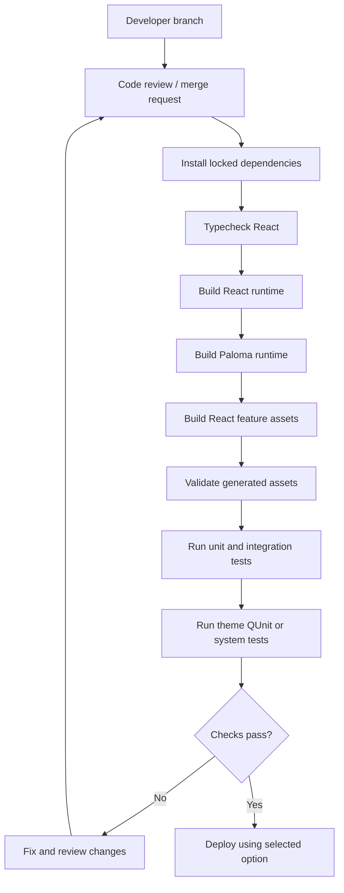
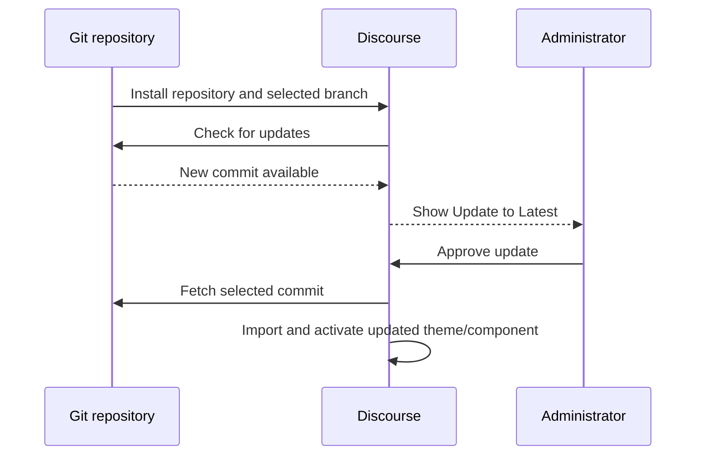
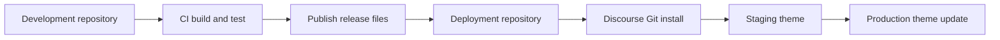
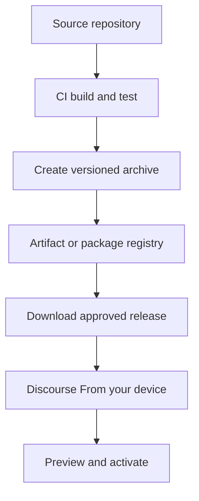
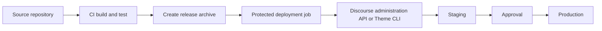
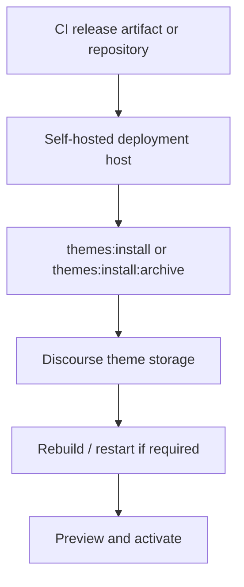
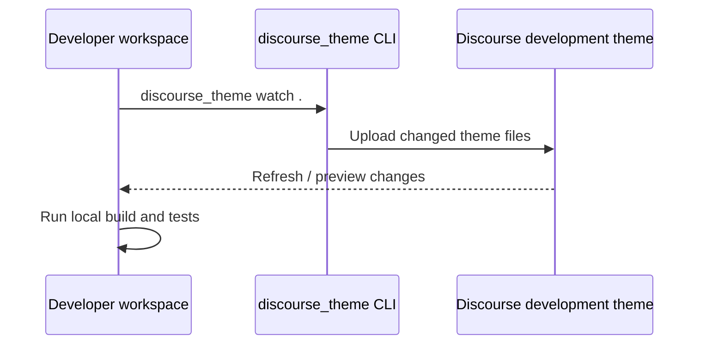

# Discourse Theme Deployment Options

## 1. Scope

This document compares practical ways to deploy a Discourse theme or theme component containing Ember/Glimmer code, React feature bundles, Paloma runtime assets, stylesheets, and generated JavaScript assets.

The same deployment options can be used for:

- A complete theme (`"component": false`).
- A reusable theme component (`"component": true`).

Every production option should build and validate the theme before deployment.

## 2. Common Build and Test Gate

The deployment mechanism should receive only a build that has passed the project checks.



For this repository, the main build gate is:

```bash
pnpm install --frozen-lockfile
pnpm typecheck:react
pnpm build
```

Generated assets under `assets/vendor/` must be included in the release. Discourse does not run pnpm, Vite, or esbuild when it installs a Git repository or imports an archive.

## 3. Option A: Install Directly From a Git Repository

Discourse installs the theme or component from a remote Git repository and tracks a selected branch.



### Characteristics

- Native Discourse installation and update workflow.
- Supports public repositories and private repositories using SSH deploy keys.
- The repository is checked periodically; administrators can also use **Check for Updates**.
- Rollback can be handled by reverting the tracked branch or selecting a previous known-good revision.
- Suitable when the repository itself is the intended deployment source.

### Typical setup

1. Open **Admin -> Appearance -> Themes and components**.
2. Choose **Install -> From a git repository**.
3. Provide the repository SSH URL and branch.
4. For a private repository, add the generated read-only SSH deploy key to the repository.
5. Install the theme or component and verify its preview before activation.

Reference: [Installing a theme from a private Git repository](https://meta.discourse.org/t/installing-a-theme-from-a-private-git-repository/82584).

## 4. Option B: Deployment Repository

A build pipeline publishes the tested release output to a dedicated deployment repository. Discourse tracks that repository instead of the development repository.



### Characteristics

- Discourse receives only the files intended for deployment.
- The deployment repository can contain generated assets and release metadata without local development tooling.
- Staging and production can track different branches or repositories.
- Rollback is a Git revert or a redeploy of a previous release commit.
- Preserves the native Git-based Discourse update workflow.

### Recommended release contents

```text
about.json
common/
javascripts/
locales/
settings.yml
stylesheets/
assets/vendor/
```

Exclude local credentials, `node_modules/`, test-only files, and development-only configuration unless the theme requires them at runtime.

## 5. Option C: Versioned Archive Import

CI creates a versioned `.zip` or `.tar.gz` release archive after the build and test gates pass.



### Characteristics

- Produces immutable, versioned releases.
- Provides a strong audit trail and straightforward rollback.
- The archive can be stored in a package registry, object store, or CI artifact store.
- The Discourse admin UI supports importing a local `.zip` or `.tar.gz`.
- Fully automated import depends on the deployment environment and the supported Discourse administration mechanism.

For self-hosted Discourse, Discourse documents archive installation through `themes:install:archive`.

Reference: [Install a Theme programmatically](https://meta.discourse.org/t/install-a-theme-programatically/191843).

## 6. Option D: CI Push Through a Deployment API or CLI

CI builds and tests the release, then uses an authenticated deployment tool or supported Discourse administration API to push the release.



### Characteristics

- Enables a fully automated staging-to-production pipeline.
- Deployment credentials remain in the CI secret store.
- Can deploy the exact artifact that passed testing.
- Supports protected production environments and manual approval jobs.
- Requires maintaining the deployment script, credentials, and API compatibility.

The Discourse Theme CLI communicates with Discourse using an API key. The CLI can also be used from development or CI environments where Ruby is available.

Reference: [Discourse Theme CLI](https://meta.discourse.org/t/install-the-discourse-theme-cli-console-app-to-help-you-build-themes/82950).

## 7. Option E: Self-Hosted Installation Tasks

Self-hosted Discourse installations can install themes from a repository or archive using server-side rake tasks and `app.yml` configuration.



### Characteristics

- Works well when the deployment team controls the Discourse server.
- Can be integrated into container or server provisioning.
- Supports repository and archive installation formats.
- Requires server or container access.
- Not the general deployment mechanism for hosted Discourse instances.

Reference: [Install a Theme programmatically](https://meta.discourse.org/t/install-a-theme-programatically/191843).

## 8. Option F: Theme CLI Live Development

The Theme CLI is intended primarily for development and live iteration.



### Characteristics

- Provides fast feedback while editing theme files.
- Useful for testing Glimmer lifecycle, React loading, Paloma rendering, and CSS behavior.
- Requires a separate development theme or preview environment for each active developer.
- Should be combined with a build-and-test pipeline before production deployment.
- Not a replacement for release versioning, review, or rollback.

Reference: [Install the Discourse Theme CLI](https://meta.discourse.org/t/install-the-discourse-theme-cli-console-app-to-help-you-build-themes/82950).

## 9. Testing Before Deployment

### React and build validation

```bash
pnpm typecheck:react
pnpm build
```

The build verifies the React runtime, Paloma runtime, feature bundles, generated asset paths, and the Paloma gzip budget.

### Theme QUnit

Discourse theme QUnit tests can be run from a Discourse development environment through `/theme-qunit` or the `themes:qunit` rake task.

```bash
bin/rake "themes:qunit[id,<theme_id>]"
```

Reference: [Run Discourse core, plugin, and theme QUnit test suites](https://meta.discourse.org/t/how-to-run-discourse-core-plugin-and-theme-qunit-test-suites/66857).

### Theme system tests

Theme system tests live under `spec/system` and can be run with:

```bash
discourse_theme rspec .
```

Use `--headful` when debugging browser behavior:

```bash
discourse_theme rspec . --headful
```

Reference: [End-to-end system testing for themes and theme components](https://meta.discourse.org/t/end-to-end-system-testing-for-themes-and-theme-components/281579).

## 10. Comparison Matrix

| Criterion | Git repository | Deployment repository | Versioned archive | CI/API or CLI | Self-hosted rake | Theme CLI |
| --- | --- | --- | --- | --- | --- | --- |
| Native Git update workflow | Yes | Yes | No | No | Optional | No |
| Immutable release artifact | Commit-based | Commit-based | Yes | Yes, if artifact-based | Optional | No |
| Staging/production promotion | Branch or repository | Branch or repository | Release version | Protected CI jobs | Server workflow | Manual |
| Rollback | Revert/revision | Revert/revision | Re-import version | Redeploy version | Server rollback | Manual |
| Best use | Standard installation | Release-only repository | Audited releases | Automated deployment | Self-hosted operations | Development |

## 11. Selection Guidance

Choose **Git repository deployment** when the normal Discourse update workflow and branch tracking are the priority.

Choose a **deployment repository** when the release repository should contain only deployable theme output while preserving Git-based updates.

Choose **versioned archives** when immutable release artifacts, auditability, and explicit rollback are the priority.

Choose **CI/API or CLI deployment** when staging-to-production promotion must be automated and controlled by CI.

Choose **self-hosted installation tasks** when the Discourse server is under the deployment team's operational control.

Use the **Theme CLI** for development and preview, not as the only production release process.

## 12. References

- [Discourse Theme CLI](https://meta.discourse.org/t/install-the-discourse-theme-cli-console-app-to-help-you-build-themes/82950)
- [Theme structure and Git updates](https://meta.discourse.org/t/structure-of-themes-and-theme-components/60848)
- [Private Git repository installation](https://meta.discourse.org/t/installing-a-theme-from-a-private-git-repository/82584)
- [Programmatic theme installation](https://meta.discourse.org/t/install-a-theme-programatically/191843)
- [Theme QUnit tests](https://meta.discourse.org/t/how-to-run-discourse-core-plugin-and-theme-qunit-test-suites/66857)
- [Theme system tests](https://meta.discourse.org/t/end-to-end-system-testing-for-themes-and-theme-components/281579)
