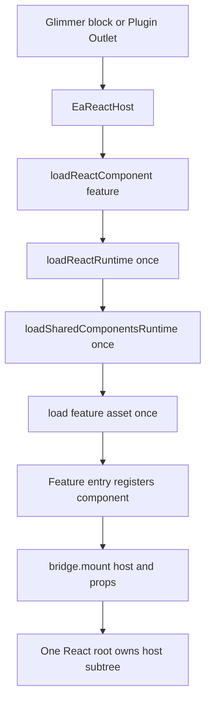
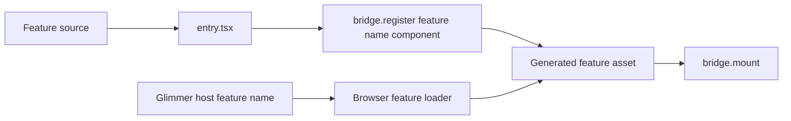
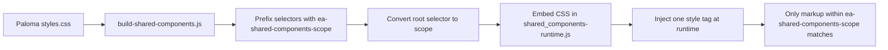

# EA Discourse React Theme Developer Guide

## 1. Purpose and Architecture Overview

This guide defines the project structure and runtime architecture for a Discourse Theme or Theme Component that integrates Ember/Glimmer with multiple isolated React features and a shared Paloma runtime.

The same source and build structure is used for both package types. The Discourse package type is selected through `about.json`:

- `"component": false` for a complete Discourse Theme.
- `"component": true` for a reusable Theme Component.

React is reserved for isolated, feature-level UI. Discourse and Glimmer remain responsible for Plugin Outlets, blocks, routing, services, lifecycle, and all DOM outside a React host. Paloma is shared by React features through a separate runtime.

## 2. Canonical Project Structure

The following is the single canonical repository structure for both a complete Theme and a Theme Component.

```text
EA Discourse React Theme / Theme Component
|
+-- about.json
|   +-- "component": false  -> Complete Theme
|   +-- "component": true   -> Theme Component
|
+-- settings.yml
+-- locales/
|   +-- en.yml
+-- common/
+-- stylesheets/
|
+-- javascripts/
|   +-- discourse/
|       +-- api-initializers/
|       +-- components/
|       |   +-- ea-react-host.gjs
|       +-- lib/
|           +-- load-react-runtime.js
|           +-- load-shared-components-runtime.js
|           +-- load-react-component.js
|
+-- react-src/
|   +-- bridge.tsx
|   +-- global.d.ts
|   +-- config/
|   +-- shared_components/
|   |   +-- index.tsx
|   |   +-- adapter.ts
|   +-- features/
|       +-- manifest.js
|       +-- <feature>/
|           +-- entry.tsx
|           +-- <Feature>.tsx
|
+-- scripts/
|   +-- build-shared-components.js
|   +-- build-react-features.js
|   +-- watch-react.js
|
+-- assets/
    +-- vendor/
        +-- react/
        |   +-- react-runtime.js
        |   +-- features/
        |       +-- <feature>.js
        +-- shared_components/
            +-- shared_components-runtime.js
```

The implementation, React feature architecture, shared runtimes, build scripts, and generated assets remain the same for both package types. Only the Discourse packaging and deployment model changes.

## 3. Ownership Boundary

The architecture is intentionally divided into four ownership areas.

| Layer | Owns |
| --- | --- |
| Discourse and Glimmer | Plugin Outlets, blocks, routing, services, lifecycle, and all DOM outside a React host. |
| React bridge | React root creation, root reuse, component registration, and idempotent cleanup. |
| React feature | Its host subtree, local state, hooks, and explicit callbacks. |
| Paloma runtime | Approved Paloma controls, shared dependencies, `ThemeProvider`, and scoped runtime CSS. |

React must not import Discourse internals, call Discourse global event buses, or query or mutate Discourse-owned DOM.

## 4. Prerequisites

- Node.js 22+
- pnpm 10+
- Discourse Theme CLI for live preview

Initial setup and validation:

```bash
pnpm install --frozen-lockfile
pnpm typecheck:react
pnpm build
```

## 5. Runtime Asset Architecture

Three generated browser assets are loaded in dependency order.

```text
react-runtime.js
    React, ReactDOM, JSX runtime, and DiscourseReactHybrid bridge
    Loaded once when a React host requests a feature

shared_components-runtime.js
    Approved Paloma controls, dependencies, ThemeProvider, scoped CSS
    Loaded once before a Paloma-backed feature asset

react/features/<feature>.js
    One React feature and its feature-only code
    Loaded only by the requested Glimmer host
```

The runtime flow is:



The sample uses the `counter` feature. Its host passes `@feature="counter"`; the generic loader fetches the base React runtime, the shared Paloma runtime, and then `assets/vendor/react/features/counter.js`.

## 6. React Feature Architecture

Every React feature is a separately built asset. The feature must self-register after its asset is loaded.



### 6.1 Feature manifest

Keep the feature manifest as the single source of truth for feature assets:

```js
export default {
  counter: {
    assetKey: "react-counter",
    entryPoint: "react-src/features/counter/entry.tsx",
    outputFile: "assets/vendor/react/features/counter.js",
  },

  profileTools: {
    assetKey: "react-profile-tools",
    entryPoint: "react-src/features/profile-tools/entry.tsx",
    outputFile: "assets/vendor/react/features/profile-tools.js",
  },
};
```

The browser loader maintains the mapping between the feature name and the generated asset.

### 6.2 Adding a feature

1. Add the feature to `react-src/features/manifest.js`.

```js
profileTools: {
  assetKey: "react-profile-tools",
  entryPoint: "react-src/features/profile-tools/entry.tsx",
  outputFile: "assets/vendor/react/features/profile-tools.js",
}
```

2. Add the matching generated asset entry to `about.json`:

```json
"react-profile-tools": "assets/vendor/react/features/profile-tools.js"
```

3. Add the feature implementation:

```text
react-src/features/profile-tools/ProfileTools.tsx
```

Keep its props serializable through `ReactBridgeProps` and keep interactive state inside React.

4. Add its feature entry:

```tsx
import ProfileTools from "./ProfileTools";

window.DiscourseReactHybrid?.register("profile-tools", ProfileTools);
```

5. Add a thin Glimmer block or Plugin Outlet connector. Pass the feature name, component name, and only serializable data:

```gjs
<EaReactHost
  @component="profile-tools"
  @componentProps={{hash profileId=this.model.id}}
  @currentUser={{this.currentUser.user}}
  @feature="profile-tools"
/>
```

6. Register the connector in an API initializer. Prefer a Plugin Outlet, then a public Discourse API, then a native Glimmer component. Use React only for genuinely complex interaction.

7. Run:

```bash
pnpm typecheck:react
pnpm build
```

Commit source files, `about.json`, and generated assets.

## 7. Paloma Runtime

The shared Paloma runtime prevents the same Paloma dependencies from being bundled into every feature.

`react-src/shared_components/index.tsx` is the only source file allowed to import `@paloma/core-ui` or `@paloma/core-ui/styles.css`.

Use narrow imports:

```tsx
import { Badge } from "@paloma/core-ui/components/Badge";
import { Button } from "@paloma/core-ui/components/Button";

window.EaSharedComponents = { Badge, Button, ThemeProvider };
```

Expose the same typed components through `react-src/shared_components/adapter.ts`:

```tsx
const { Button, ThemeProvider } = getSharedComponents();
```

Features must use the adapter instead of reading `window.EaSharedComponents` directly.

Every Paloma-backed feature must render inside both the Paloma scope and provider:

```tsx
<div className="ea-shared-components-scope">
  <ThemeProvider theme="ea-blue" mode="light">
    <Button onPress={save}>Save</Button>
  </ThemeProvider>
</div>
```

## 8. Paloma CSS Isolation

Paloma CSS contains broad utility selectors. It must never be imported from `common.scss`, `stylesheets/`, `.gjs` files, or feature entry points.



`build-shared-components.js` injects the scoped stylesheet once. This prevents Paloma utilities from affecting Discourse outside the React feature subtree.

## 9. Theme and Theme Component Packaging

The canonical source structure in Section 2 is shared by both package types. The Discourse package type is selected in `about.json`.

### 9.1 Complete Theme

```json
{
  "name": "EA Discourse Theme",
  "component": false
}
```

The repository is installed as the site's main Discourse Theme. Its `settings.yml` controls theme-level and React feature configuration.

Runtime relationship:

```text
Complete Theme
      |
      +-- about.json -> component: false
      +-- settings.yml
      +-- React / Paloma assets
               |
               v
        Discourse Theme
               |
               v
       Plugin Outlet / GJS
               |
               v
          EaReactHost
```

### 9.2 Theme Component

```json
{
  "name": "EA React Components",
  "component": true
}
```

The same repository structure is installed as a Theme Component and then connected to selected Discourse Themes.

Runtime relationship:

```text
Theme Component
      |
      +-- about.json -> component: true
      +-- settings.yml
      +-- React / Paloma assets
               |
               v
       Discourse Admin
               |
               +-- Install component
               +-- Select theme(s)
               +-- Configure component settings
                         |
                         v
                  Plugin Outlet / GJS
                         |
                         v
                    EaReactHost
```

The Theme Component model is the preferred packaging model when the React functionality is intended to be reusable across multiple Discourse Themes.

### 9.3 Packaging comparison

| Concern | Complete Theme | Theme Component |
| --- | --- | --- |
| `about.json` | `"component": false` | `"component": true` |
| Repository/folder structure | Shared canonical structure | Shared canonical structure |
| `settings.yml` | Supported | Supported |
| `locales/` | Supported | Supported |
| `javascripts/` | Supported | Supported |
| `stylesheets/` | Supported | Supported |
| `assets/` | Supported | Supported |
| React source/build structure | Same | Same |
| Multiple React feature bundles | Supported | Supported |
| Theme admin settings | Yes | Yes |
| Relationship to a Discourse Theme | It is the Theme | Attached to selected Theme(s) |
| Intended deployment | Full site Theme | Reusable functionality layered onto a Theme |

## 10. Theme Component Settings and Feature Enablement

The Theme Component exposes React feature configuration through its root `settings.yml`.

### 10.1 Feature enablement settings

```yaml
enable_ea_react:
  default: true
  type: bool

enable_counter:
  default: true
  type: bool

enable_profile_tools:
  default: false
  type: bool

enable_another_feature:
  default: false
  type: bool
```

Additional feature-specific settings can be defined alongside the enable flags:

```yaml
counter_initial_value:
  default: 0
  type: integer

profile_tools_mode:
  default: standard
  type: enum
  choices:
    - standard
    - advanced
```

The guide uses `settings.yml` as the configuration boundary between the Discourse administrator and the React feature system. Theme settings are exposed to theme JavaScript as `settings.<setting_name>`.

### 10.2 Group-restricted feature

For group-restricted features, use a group-backed setting with `resolve_group_membership: true`:

```yaml
profile_tools_allowed_groups:
  default: ""
  type: list
  list_type: group
  resolve_group_membership: true
```

The guide uses the corresponding `settings.user_in_profile_tools_allowed_groups` boolean in theme JavaScript so the group membership decision is performed through Discourse configuration rather than by inspecting `currentUser.groups` inside React.

## 11. Administrator Flow

The intended Theme Component administrator flow is:

```text
Discourse Admin
      |
      v
Themes and Components
      |
      +-- Install EA React Components
      |
      +-- Select the Discourse Theme(s) that use the component
      |
      +-- Open component settings
                 |
                 +-- EA React = ON
                 +-- Counter = ON
                 +-- Profile Tools = OFF
                 +-- Another Feature = ON
```

There are two levels of enablement:

1. Theme level: the administrator decides which Discourse Theme(s) use the EA React Theme Component.
2. Feature level: the administrator decides which React features inside the component are enabled.

This keeps multiple React features in one reusable Theme Component instead of creating a separate Discourse Theme Component repository for every feature.

## 12. Feature Loading and Runtime Gating

The feature setting should be evaluated before the feature bundle is loaded.

```text
Plugin Outlet / Glimmer host
            |
            v
       EaReactHost
            |
            v
   Read feature configuration
            |
       +----+----+
       |         |
    enabled    disabled
       |         |
       v         +-- Do not load feature bundle
load feature.js
       |
       v
register feature with bridge
       |
       v
mount one React root
```

The shared React runtime and shared Paloma runtime remain common across features. Each React feature remains a separate generated asset so that individual feature bundles can be loaded only when requested and enabled.

## 13. Configuration Boundary

React features should not import Discourse internals or read the global Discourse `settings` object directly.

The Discourse/Glimmer layer translates theme settings and contextual Discourse data into serializable React props/configuration:

```text
settings.yml
     |
     v
Discourse settings
     |
     v
API initializer / Glimmer connector
     |
     v
EaReactHost
     |
     | serializable props/config
     v
React feature
```

Example:

```gjs
<EaReactHost
  @feature="profile-tools"
  @component="profile-tools"
  @componentProps={{hash
    enabled=settings.enable_profile_tools
    mode=settings.profile_tools_mode
  }}
/>
```

React receives normal props/configuration and remains independent from Discourse internal services, event buses, and DOM.

## 14. Build and Watch

| Command | Purpose |
| --- | --- |
| `pnpm typecheck:react` | Strict TypeScript validation for `react-src`. |
| `pnpm build:react` | Builds the base React runtime. |
| `pnpm build:shared_components` | Builds the shared Paloma runtime, scopes CSS, and enforces its size budget. |
| `pnpm build:features` | Builds every feature in the feature manifest. |
| `pnpm build` | Runs all production builds in order. |
| `pnpm watch` | Keeps the base React, Paloma, and feature bundles rebuilding during development. |
| `discourse_theme watch .` | Syncs/previews the theme against Discourse. |

Run `pnpm watch` and `discourse_theme watch .` in separate terminals.

A theme installed from Git does not run pnpm. Generated files under `assets/vendor/` therefore need to be included in the committed release.

## 15. Asset and Size Policy

`about.json` is static Discourse metadata and asset registration.

Every separately lazy-loaded feature requires:

- A feature manifest entry.
- A matching generated asset registration in `about.json`.
- The same feature name and asset key in the browser loader's `featureAssets` mapping.
- A generated feature asset under `assets/vendor/react/features/`.

The shared Paloma runtime has a hard 10 MB gzip budget. `pnpm build:shared_components` fails when the generated asset exceeds it.

This is a ceiling, not a target. Use narrow Paloma imports, review runtime size when adding controls, and keep feature bundles small by externalizing React and Paloma.

## 16. Verification Checklist

Before release, verify:

- `pnpm typecheck:react` passes.
- `pnpm build` passes.
- Generated React, Paloma, and feature assets are committed.
- Runtime loaders fetch each asset once and reuse cached promises.
- Each host creates one React root and cleanup is safe to call more than once.
- Navigating away unmounts React; returning remounts it without duplicate handlers.
- Anonymous and signed-in visitors receive valid serializable props.
- Feature settings correctly prevent disabled feature bundles from being loaded or mounted.
- Paloma CSS remains under `.ea-shared-components-scope`.
- Keyboard navigation works.
- Visible focus works.
- Mobile layout works.
- Both Discourse color schemes work.

## 17. Recommended End-to-End Model

Use one repository and one source/build structure for both package types.

```text
                    ONE CANONICAL REPOSITORY
                              |
                 +------------+------------+
                 |                         |
          Complete Theme            Theme Component
          component: false          component: true
                 |                         |
                 |                         +-- Installed as component
                 |                         +-- Connected to Theme(s)
                 |                         +-- Feature settings
                 | 
                 +------------+------------+
                              |
                       Shared React layer
                              |
                 +------------+------------+
                 |            |            |
              Counter    Profile Tools   Feature N
                 |            |            |
                 +------------+------------+
                              |
                    Shared React Runtime
                              |
                    Shared Paloma Runtime
```

The implementation does not require separate folder structures for Theme and Theme Component. Keep the React runtime, feature manifest, feature bundles, Paloma runtime, Glimmer host, build scripts, generated assets, and configuration model shared. Use `about.json` to select the Discourse package type, and use `settings.yml` to control which React features are enabled when the reusable Theme Component is installed.

## 18. Source-of-Truth Notes

This guide consolidates the architecture already defined in the project document into one canonical structure and one flow per responsibility:

- The repository structure is defined once in Section 2.
- Theme versus Theme Component packaging is defined in Section 9.
- Feature settings and administrator control are defined in Sections 10 and 11.
- Runtime gating is defined in Section 12.
- The Discourse-to-React configuration boundary is defined in Section 13.
- Build, asset, and verification requirements are defined in Sections 14-16.

No separate React folder structure is required for a Theme versus a Theme Component.
